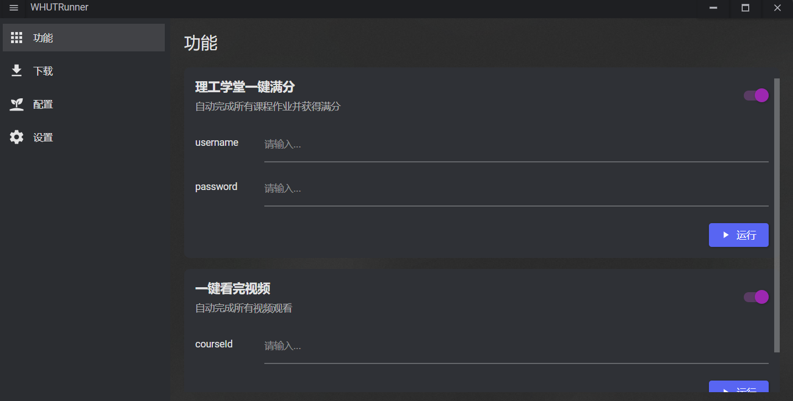
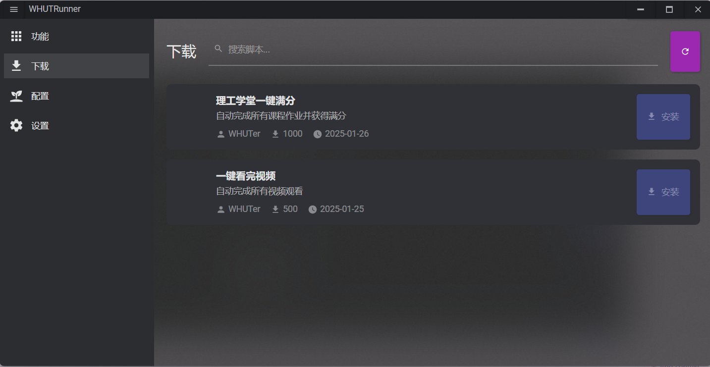

# WHUTRunner

WHUTRunner 是一个基于 Avalonia UI 的跨平台自动化工具，用于管理和运行 Python 和 Node.js 脚本。它提供了一个现代化的用户界面，支持脚本的下载、安装和运行。
(注：有点BUG还在开发中)

## 运行预览



## 功能特点

- 🎯 现代化的 Discord 风格界面
- 🔄 支持 Python 和 Node.js 脚本
- 📦 内置脚本包管理器
- ⚙️ 可视化环境配置
- 🎨 自定义主题和样式
- 💾 配置自动保存
- 🔍 脚本搜索功能
- 📊 运行状态监控

## 系统要求

- .NET 8.0 或更高版本
- Python 3.x（可选，用于运行 Python 脚本）
- Node.js（可选，用于运行 JavaScript 脚本）

## 安装说明

1. 从 [Releases](https://github.com/yourusername/WHUTRunner/releases) 下载最新版本
2. 解压到任意目录
3. 运行 `WHUTRunner.exe`

## 使用方法

### 环境配置

1. 打开"配置"页面
2. 设置 Python 和 Node.js 的路径
3. 添加需要的包依赖
4. 点击"检查环境"确保配置正确
5. 点击"安装依赖"安装所需包

### 运行脚本

1. 在"功能"页面选择要运行的脚本
2. 填写必要的参数
3. 点击"运行"开始执行
4. 可以随时点击"停止"终止运行

### 下载脚本

1. 打开"下载"页面
2. 浏览或搜索可用脚本
3. 点击"安装"下载并安装脚本
4. 安装完成后即可在"功能"页面使用

## 开发说明

### 依赖项

- Avalonia UI 11.2.1
- .NET 8.0
- ReactiveUI
- Material.Avalonia
- DialogHost.Avalonia

### 项目结构
``` bash
WHUTRunner/
├── Assets/ # 资源文件
├── Models/ # 数据模型
├── Services/ # 服务接口和实现
├── ViewModels/ # 视图模型
├── Views/ # 视图
└── App.axaml # 应用程序入口
```

### 构建项目
``` bash
## 克隆仓库
git clone https://github.com/yourusername/WHUTRunner.git

##进入项目目录
cd WHUTRunner

## 还原包
dotnet restore

##构建项目
dotnet build

## 运行项目
dotnet run

```


## 贡献指南

1. Fork 本仓库
2. 创建特性分支 (`git checkout -b feature/AmazingFeature`)
3. 提交更改 (`git commit -m 'Add some AmazingFeature'`)
4. 推送到分支 (`git push origin feature/AmazingFeature`)
5. 创建 Pull Request

## 许可证

本项目采用 GNU AFFERO GENERAL PUBLIC LICENSE 许可证 - 详见 [LICENSE](LICENSE) 文件

## 联系方式

- 项目主页：[https://github.com/yourusername/WHUTRunner](https://github.com/yourusername/WHUTRunner)
- 问题反馈：[https://github.com/yourusername/WHUTRunner/issues](https://github.com/yourusername/WHUTRunner/issues)
